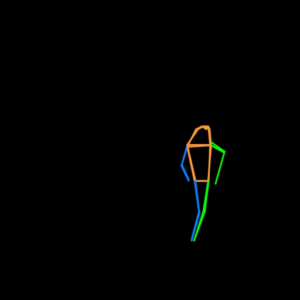
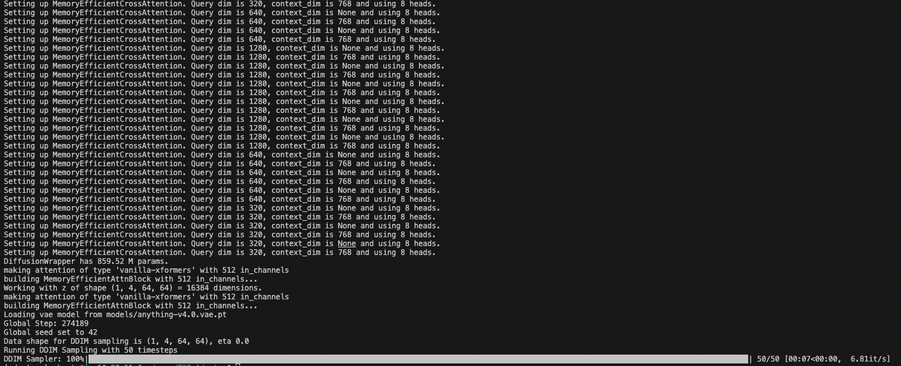

# T2I - ADAPTERS Experiments Reproduce

T2I-Adapters possess practical advantages such as composability and generalization ability. Extensive experiments will be
conducted to assess the quality of the generated outputs and explore various applications. This project seeks to replicate and validate the original study’s results, contributing to the advancement of T2I models. Furthermore, it aims to provide
additional insights and potential improvements for future research in this field.

Changed parts:
- Dataset has chosen differently from the orginal study. (Version 2 and overall rate over 6.5)
- Dataset: https://laion.ai/blog/laion-aesthetics/
- train, test part re-implemented
- data generation has been done by mmpose implementation
- For the extra model zoo please check: https://github.com/TencentARC/T2I-Adapter (VQGAN, SD1.4)

<p align="center">
  
  <!-- You can find more examples [here](docs/examples.md) -->
</p>

# Download Models

Put the downloaded models in the `T2I-Adapter/models` folder.

1. You can find re-trained model with following link: https://drive.google.com/file/d/1TSKOSAQ3tmngsnYSOTbi_ixeiCpV5Dmx/view?usp=sharing
2. A base SD model is still needed to inference. We recommend to use **Stable Diffusion v1.5**. But please note that the adapters should work well on other SD models which are finetuned from SD-V1.4 or SD-V1.5. You can download these models from HuggingFace or civitai, all the following tested models (e.g., Anything anime model) can be found in there.
3. For the sake of demonstration, I have added the repository MMPose inference script.
4. You can find easy implementation in the Huggingface for the MMPose repository.

# Dependencies and Installation

- Python >= 3.6 (Recommend to use [Anaconda](https://www.anaconda.com/download/#linux) or [Miniconda](https://docs.conda.io/en/latest/miniconda.html))
- [PyTorch >= 1.4](https://pytorch.org/)
```bash
pip install -r requirements.txt
```
- If you want to use the full function of keypose-guided generation, you need to install MMPose. For details please refer to <https://github.com/open-mmlab/mmpose>.

# How to Test

#### **Keypose Adapter**

```bash
# when input pose image
python test.py --which_cond keypose --cond_path examples/keypose/person_keypose.png --cond_inp_type keypose --prompt "astronaut, best quality, extremely detailed" --sd_ckpt models/v1-5-pruned-emaonly.ckpt --resize_short_edge 512 --cond_tau 1.0 --cond_weight 1.0 --n_samples 2 --adapter_ckpt models/best_checkpoint_t2iadapter.pth
```
### Condition MMPose Map

### Produced Result

### Inference Step
Prompt = "the lady walks in the forest"


